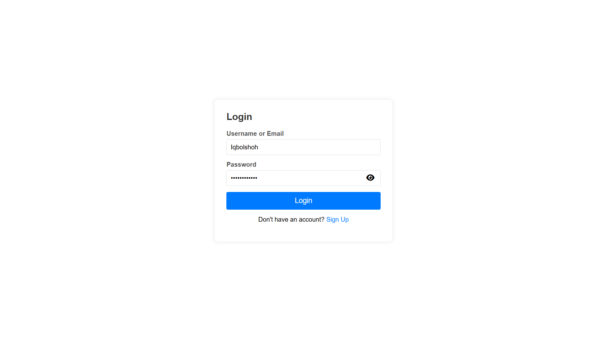

# 🛡️ PHP User Role Manager  

This repository is a **user management system** built using **PHP**. It includes functionalities for **user registration, login, and role management**.  



🖥 **Admin Login:** `iqbolshoh`  
👤 **User Login:** `user`  
🔑 **Password:** `IQBOLSHOH`  

## ✨ Features  

✅ **🔐 User Roles** – Admin & User roles with specific access controls.  
✅ **🔑 Secure Authentication** – Password hashing for secure login & registration.  
✅ **📂 File Uploads** – Users can upload profile images (all images except `default.png` are securely encrypted).  
✅ **🔒 Role-Based Access** – Different pages & functionalities accessible based on user roles.  

## 📊 **Preview Pages**  

### 🏢 **Admin Dashboard**  
  

### 👤 **User Dashboard**  
  

## 🛠️ **Setting Up the Project**  

### 📥 1. **Clone the Repository**  
```bash
git clone https://github.com/Iqbolshoh/php-user-role-manager.git
cd php-user-role-manager
```  

### 🗄️ 2. **Import the Database**  
```bash
mysql -u yourusername -p yourpassword < database.sql
```  

### ⚙️ 3. **Configure the Database Connection in `config.php`**  
```php
define("DB_SERVER", "localhost");
define("DB_USERNAME", "root");
define("DB_PASSWORD", "");
define("DB_NAME", "roles");
```

---


## 🖥 Technologies Used


## 📜 License
This project is open-source and available under the **MIT License**.

## 🤝 Contributing  
🎯 Contributions are welcome! If you have suggestions or want to enhance the project, feel free to fork the repository and submit a pull request.

## 📬 Connect with Me  
💬 I love meeting new people and discussing tech, business, and creative ideas. Let’s connect! You can reach me on these platforms:

<div align="center">
  <table>
    <tr>
      <td>
        <a href="https://iqbolshoh.uz" target="_blank">
          
        </a>
      </td>
      <td>
        <a href="mailto:iilhomjonov777@gmail.com" target="_blank">
          
        </a>
      </td>
      <td>
        <a href="https://github.com/iqbolshoh" target="_blank">
          
        </a>
      </td>
      <td>
        <a href="https://www.linkedin.com/in/iqbolshoh/" target="_blank">
          
        </a>
      </td>
      <td>
        <a href="https://t.me/iqbolshoh_777" target="_blank">
          
        </a>
      </td>
      <td>
        <a href="https://wa.me/998997799333" target="_blank">
          
        </a>
      </td>
      <td>
        <a href="https://instagram.com/iqbolshoh_777" target="_blank">
          
        </a>
      </td>
      <td>
        <a href="https://x.com/iqbolshoh_777" target="_blank">
          
        </a>
      </td>
      <td>
        <a href="https://www.youtube.com/@Iqbolshoh_777" target="_blank">
          
        </a>
      </td>
    </tr>
  </table>
</div>
